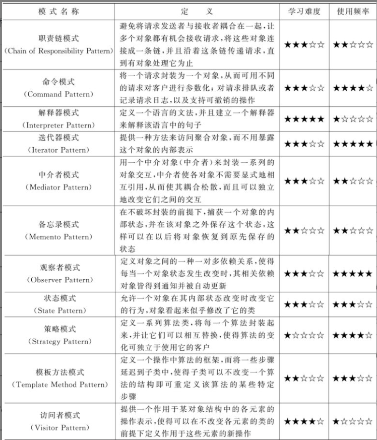

# 前言

设计模式通常分为三大类：创建型（Creational）、结构型（Structural）、和行为型（Behavioral）。这些模式旨在解决常见的软件设计问题。以下是这三类设计模式的分类：

### 创建型模式 (Creational Patterns)
这类模式主要涉及对象创建机制，旨在增加已有代码的灵活性和复用性。
1. **单例模式** (Singleton Pattern)
2. **工厂方法模式** (Factory Method Pattern)
3. **抽象工厂模式** (Abstract Factory Pattern)
4. **建造者模式** (Builder Pattern)
5. **原型模式** (Prototype Pattern)

### 结构型模式 (Structural Patterns)

结构型模式关注如何组合类和对象以形成更大的结构，同时保持结构的灵活和高效。
1. **适配器模式** (Adapter Pattern)
2. **桥接模式** (Bridge Pattern)
3. **组合模式** (Composite Pattern)
4. **装饰模式** (Decorator Pattern)
5. **外观模式** (Facade Pattern)
6. **享元模式** (Flyweight Pattern)
7. **代理模式** (Proxy Pattern)

### 行为型模式 (Behavioral Patterns)

行为型模式专注于算法和对象间职责的分配。
1. **策略模式** (Strategy Pattern)
2. **模板方法模式** (Template Method Pattern)
3. **观察者模式** (Observer Pattern)
4. **迭代器模式** (Iterator Pattern)
5. **责任链模式** (Chain of Responsibility Pattern)
6. **命令模式** (Command Pattern)
7. **备忘录模式** (Memento Pattern)
8. **状态模式** (State Pattern)
9. **访问者模式** (Visitor Pattern)
10. **中介者模式** (Mediator Pattern)
11. **解释器模式** (Interpreter Pattern)

这些模式共计23种，每种设计模式在软件开发中都有其特定的用途，可以帮助开发人员解决特定的设计问题，提高软件的可维护性和可扩展性。

# 创建型模式

## 单例模式

私有化构造函数, 这样只能通过调用静态方法得到对象

## 简单工厂模式

一个中心化的工厂类决定创建哪种类型的实例，**基于给定的参数**。这种模式通常用于管理和封装对象的创建过程

### 优点

1. **封装性**：工厂类封装了创建实例的逻辑，调用者无需了解如何创建实例的细节，只需要提供正确的参数。
2. **代码解耦**：客户代码从具体类解耦出来，增加了系统的灵活性，因为客户代码不依赖于具体的类实现。这使得修改或扩展对象创建逻辑变得更容易。
3. **集中管理**：创建对象的代码集中在一个位置，便于维护和修改。也便于实现统一的逻辑检查或设置默认值。
4. **简化调用代码**：客户端只需要知道工厂的接口，不需要关心对象的实例化过程，使得代码更简洁。

### 缺点

1. **违反开闭原则**：简单工厂模式的工厂类通常使用条件语句来决定实例化哪一个类。如果需要添加新的产品类，就必须修改工厂类的代码，这违反了开闭原则（软件实体应当对扩展开放，对修改封闭）。
2. **过多的职责**：工厂类集中了所有产品的创建逻辑，随着应用程序的发展，工厂类可能会变得非常庞大，承担过多的职责，从而变得难以维护。
3. **可扩展性问题**：在产品种类非常多的情况下，工厂类的逻辑会变得复杂，每添加一个新的产品都需要修改工厂类的代码，这使得系统的可扩展性变差。
4. **不够灵活**：简单工厂很难支持产品类的多样化变化。每次添加新的产品实现，都需要修改工厂类，这使得工厂类与产品实现紧密耦合。

## 工厂方法模式

它定义了一个用于创建对象的接口，但**让子类决定要实例化的类是哪一个**。这样，**工厂方法使一个类的实例化延迟到其子类**。

### 优点

1. **符合开闭原则**：在工厂方法模式中，如果需要添加新的产品类，只需添加一个相应的具体工厂类，无需修改已有代码。这符合开闭原则，即软件实体应当对扩展开放，对修改封闭。
2. **解耦框架和实现**：工厂方法模式可以使一个类的实现独立于其产品的创建和组合，这样类的设计就可以面向接口编程，而不是面向实现编程。
3. **单一职责原则**：每个工厂类只负责创建单一产品，这符合单一职责原则，即一个类和模块应该只有一个改变的原因。
4. **更多的灵活性**：工厂方法模式可以引入新的工厂类来提供新的实现方式，不需要修改现有系统代码。

### 缺点

1. **类的数量增多**：**每增加一个新的产品，不仅要增加一个新的产品类，通常还需要增加与之对应的工厂类**，这会使得系统中类的数量成倍增加，增加了系统的复杂性。
2. **系统复杂性提高**：更多的设计引入了更多的抽象层次，虽然提高了系统的灵活性，但也使得系统的理解和配置变得更加复杂。
3. **增加了代码和结构的复杂度**：虽然遵循了开闭原则，但是在某些情况下过多地使用工厂方法模式可能会导致代码更加难以跟踪和管理。

## 抽象工厂模式

用于创建一系列相关或相互依赖的对象，而无需指定它们具体的类。抽象工厂模式允许客户端使用抽象的接口来**创建一组相关的产品**，而不需要关心这些产品的具体实现。这种模式特别适用于**处理产品族的创建**，并确保客户端与具体实现的解耦

### 优点

1. **促进模块化**：客户端代码只需要关心接口而不是具体类的实现，这有助于降低系统各个模块之间的依赖关系，从而提高模块化水平。
2. **增强程序的可扩展性**：**新增一组产品只需要添加一个新的具体工厂**，不需要修改已有的代码，符合开闭原则。
3. **隔离具体类的生成**：由于工厂类负责生成产品类的实例，客户端完全不需要知道它们的具体实现。这简化了客户端的操作，并使代码更容易维护。
4. **替换产品系列变得容易**：如果整个产品系列需要替换，客户端可以简单地更换用来创建产品的工厂，这可以通过改变具体工厂的实例化轻松实现。

### 缺点

1. **难以支持新种类的产品**：如果需要添加新的产品（即不仅仅是现有系列的新实例，**而是整个系列中新增加的一个新种类的产品**），则需要修改抽象工厂的接口及其所有子类，这违反了开闭原则。
2. **系统复杂性增加**：随着产品种类和具体实现的增加，相关的具体工厂类和产品类的数量也会增加，导致系统结构和实现的复杂性增大。
3. **代码量增加**：每添加一种新的产品或者产品族，都需要增加新的具体工厂类和产品类，这可能导致代码膨胀。

抽象工厂模式非常适合那些涉及到**多个系列产品的大型系统设计**。它可以在一定程度上提高程序的抽象性和可维护性，但同时也带来了增加的复杂性和某些情况下的灵活性限制。在设计时，应该根据项目的具体需求来权衡是否使用抽象工厂模式。

## 建造者模式

供了一种创建复杂对象的最佳方式。该模式允许你分步骤构造复杂对象，并允许按步骤或按需构造。这与直接实例化一个包含全部必需属性的对象的复杂性相比，可以使代码更加清晰且易于维护。

### 优点

1. **分离复杂对象的构造和表示**：建造者模式提供了分离对象子组件的创建和组装过程的方法。通过这种方式，同样的构建过程可以创建不同的表示。
2. **控制细节隐藏**：建造者模式允许产品的内部表示被隐藏起来。客户端不需要知道产品内部组成的细节，它只需要知道如何通过建造者接口构建对象。
3. **提供变化的构造过程**：建造者模式提供了将一个复杂对象的构建过程封装成为多个步骤，且可以改变过程以创建不同类型的对象。这对于构建具有复杂内部结构的对象特别有用。
4. **更好的可扩展性**：增加新的类型的产品仅需定义一个具体的建造者，无需修改原有代码，符合开闭原则。

### 缺点

1. **增加系统的复杂性**：为了创建一个对象，你可能需要实现多个建造者和导演类（Director），这可能会增加系统的复杂性。
2. **增加代码量**：需要编写更多的代码，分别实现每个步骤和不同的建造者。
3. **用户需要有更深的了解**：用户需要知道如何正确地使用建造者和导演类来构建对象，这可能增加了使用难度。

建造者模式非常适合用于那些需要生成的对象具有复杂内部结构的场合，尤其是当对象的构造过程需要多个步骤时。此外，当系统需要多种类型的对象，并且对象之间差异很大时（不只是配置的差异），建造者模式也非常适用。通过适当使用建造者模式，可以确保代码的稳定性和可维护性。

# 结构型模式

## 适配器模式

适配器模式（Adapter Pattern）是一种结构型设计模式，**它允许不兼容的接口之间进行交互**。通过这种方式，适配器可以帮助两个原本由于接口不兼容而不能一起工作的类能够一起工作。适配器模式通常用于系统的集成或者在使用某些现有类但其接口与其他代码不匹配的情况下。

### 适配器模式的优点

1. **提高类的复用性**：
   - 适配器能够让原本因接口不兼容而不能一起工作的类可以一起工作。这样可以重用现有的类，即便它们的接口不符合现有系统的需求。
   
2. **增加类的透明性和灵活性**：
   - 通过将一个类的接口转换成另一个接口，适配器让具体的类与其他代码解耦，增加了类的透明性和灵活性。
   
3. **更好的控制系统中的功能改变**：
   - 通过适配器，可以在不修改现有代码的情况下引入几个新类，并使它们与未来的环境适应。

### 适配器模式的缺点

1. **系统的复杂性**：
   - 引入适配器可能会增加系统的整体复杂性，因为你需要理解和处理原本不兼容的接口之间的交互关系。
   
2. **代码管理**：
   - 随着系统适配器的增多，维护可能会变得更复杂，尤其是在需要跟踪和理解原始代码及其适配后行为的情况下。
   
3. **过多的使用适配器可能导致代码不清晰**：
   - 过度使用适配器模式可能会导致代码难以理解和维护。例如，过多的层和间接的调用可能会让系统变得难以追踪和调试。

适配器模式**非常适用于希望重用一些现存的类，但其接口与其他代码不兼容的情况**。例如，在需要使用多个现有库的功能，而这些库的接口之间不一致时，可以通过适配器来解决兼容性问题，从而无需重写现有代码就能够将它们整合到应用中。

## 桥接模式

桥接模式（Bridge Pattern）是一种结构型设计模式，旨在将抽象部分与其实现部分分离，使它们可以独立地变化。通过这种方式，桥接模式增加了系统的灵活性，**使得抽象和实现可以通过组合的方式而不是继承来定义**。这种模式主要用于**处理可能需要多个维度的变化的情况**，使得**每个维度可以独立地扩展**。

### 桥接模式的优点

1. **分离抽象与实现**：
   - 桥接模式分离了抽象接口及其实现部分，这使得它们可以独立地进行变化。这种分离也帮助避免在抽象层代码中混入具体类的信息，从而使抽象和实现可以独立地扩展。

2. **提高可扩展性**：
   - 由于抽象和实现可以独立变化，所以增加新的实现或扩展抽象部分变得更加容易，不会影响到另一端。

3. **实现细节对客户透明**：
   - 客户端代码仅仅依赖于抽象层部分，不需要关心实现层的细节。这降低了系统各部分之间的耦合度。

4. **动态绑定**：
   - 你可以在运行时切换不同的实现，因为实现部分是独立于抽象部分的，所以可以动态地替换。

### 桥接模式的缺点

1. **增加了系统的复杂性**：
   - 桥接模式的引入会增加系统的理解和设计的复杂性。对于新手程序员来说，理解如何正确地将系统分解为抽象和实现可能是一项挑战。

2. **需要正确识别系统的两个独立变化维度**：
   - 桥接模式的成功关键在于识别出系统中两个独立变化的维度，这可能需要对系统有深入的了解和正确的预见，否则可能会造成错误的设计。

3. **增加代码的维护成本**：
   - 桥接模式需要创建抽象和实现两个接口及其之间的桥接关系，这在一些简单的场景中可能会感觉有些过度，增加了代码的维护成本。

桥接模式适用于那些需要**处理多个维度变化的系统**，例如UI框架中不同的用户界面和支持多个操作系统的情况。在这样的系统中，桥接模式可以帮助我们独立地扩展抽象和实现部分，从而使代码更加灵活和可维护。